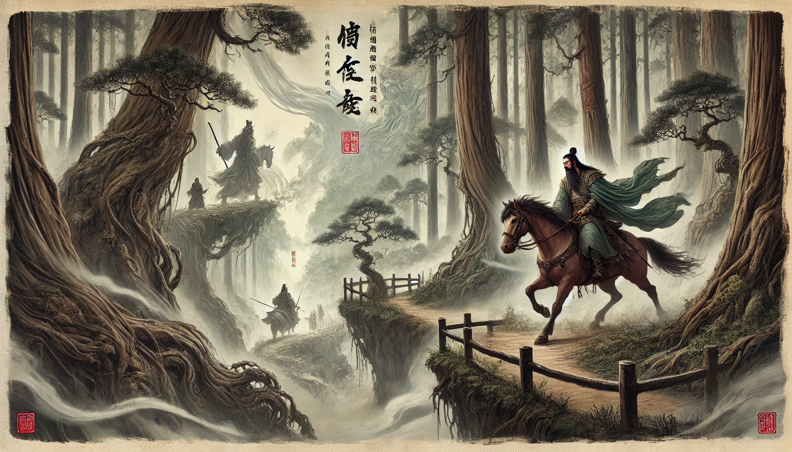

# Klotski: The Sliding Block Puzzle  


Klotski is a sliding block puzzle that's popular throughout China. Its story is based on a well-known encounter during the **Eastern Han dynasty (25–220)** between **Cao Cao**, the shrewd and clever strategist for the Wei Kingdom, and **Guan Yu**, a commander in the Shu Kingdom army who had once served under Cao Cao.  

### **Gameplay**  
The goal is to move the largest block (2x2 block) to an exit with a two-grid side length below without taking it away from the board, while only sliding the blocks.

---

### **Historical Background**  
The game is named after the story of **Cao Cao's defeat on the Huarong Road** in *"Romance of the Three Kingdoms"* and **Guan Yunchang's righteous explanation of Cao Cao's release**.  

However, the origin of this game is not what most people consider to be "one of the oldest games in China." The history of the Huarongdao game is relatively short:  

- **1934**: John Harold Fleming obtained a patent for a similar puzzle in England.  
- **1943**: Liang Qing, a teacher in the New Fourth Route Army, publicized the Huarong Dao after learning it from people in northern Jiangsu province. It became popular among soldiers as a way to enhance their cultural life.  

### **International Variants**  
- **France**: A similar game is known as *"Red Donkey."*  
- **Japan**: Similar games are called *"箱入り娘"* ("Daughter in a Box"), with variations including versions based on Japanese chess (*shogi*).  


## Technical Stack

- **Language**: TypeScript 4.x
- **Build Tool**: Vite
- **Styling**: CSS with CSS Variables for theming
- **Architecture**: Component-based design

## Key Features

### Game Logic
- Grid-based movement system (4x5 grid)
- Block collision detection
- Move history tracking for undo functionality
- Local storage for score persistence

### Internationalization
- Language detection based on browser settings
- Dynamic text updates without page reload
- Parameterized translations
- Extensible translation system

### State Management
- Game state handled through TypeScript classes
- Move validation with collision detection
- History management for undo feature

### User Interface
- CSS Grid for game board layout
- CSS Variables for theming
- Responsive design
- Touch-friendly controls

### Type System
- Strict TypeScript typing
- Interface definitions for game entities
- Type safety for game state management

## Development

### Prerequisites
- Node.js 14+
- npm or yarn

### Setup
```bash
npm install   # Install dependencies
npm run dev   # Start development server
npm run build # Build for production
